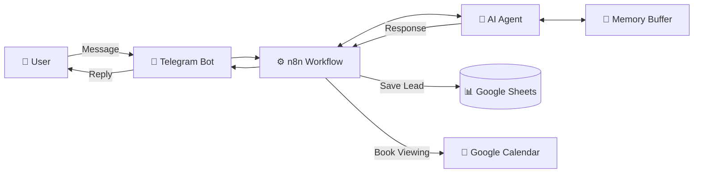

<div align="center">

# 🏠 Real Estate Lead Qualification AI Agent

[](https://n8n.io/)
[](https://t.me/AqariAgent_Elshamy_bot)
[](https://sheets.google.com/)
[](https://calendar.google.com/)

**An advanced AI-driven automation built with n8n to serve as a smart real estate assistant via Telegram.**

_The agent engages users, qualifies leads, and automates data management and scheduling._

[🤖 Try the Bot](https://t.me/AqariAgent_Elshamy_bot)

</div>

---

## 📑 Table of Contents

- [Key Features](#-key-features)
- [Demo](#-demo)
- [Tech Stack](#️-tech-stack)
- [Architecture](#-architecture)
- [Database Structure](#-database-structure)
- [Setup Guide](#️-setup-guide)
- [Lead Scoring Logic](#-lead-scoring-logic)
- [Author](#-author)

---

## 🚀 Key Features

| Feature                              | Description                                                                                    |
| ------------------------------------ | ---------------------------------------------------------------------------------------------- |
| 🧠 **Smart Data Extraction**         | Automatically identifies and collects 9 essential data points from natural conversation        |
| 📊 **Lead Scoring**                  | Internally ranks leads as **High**, **Medium**, or **Low** based on buying intent and capacity |
| 📝 **Automated CRM Logging**         | Seamlessly records all lead interactions into a structured Google Sheet                        |
| 📅 **Automated Appointment Booking** | Proactively offers and schedules property viewings in Google Calendar for high-priority leads  |
| 💬 **Conversational AI**             | Natural, human-like dialogue powered by LLM with context memory                                |
| 🔒 **Zero Redundancy**               | Never asks for information already mentioned in conversation                                   |

---

## 🎬 Demo

### Try the Live Bot

<div align="center">

[](https://t.me/AqariAgent_Elshamy_bot)

**👉 Click above or search `@AqariAgent_Elshamy_bot` on Telegram**

</div>

### Example Conversation

```
👤 User: Hi, I'm looking for an apartment in downtown

🤖 Aqari AI: Hello! Welcome to Elshamy_Aqari Company! I'd love to help you
             find the perfect apartment. Are you looking to buy or rent?

👤 User: Buy, preferably something new under $300k

🤖 Aqari AI: Excellent choice! A new apartment under $300k.
             What's your ideal timeline for making this purchase?

👤 User: Within the next 2 months

🤖 Aqari AI: Perfect! That's a great timeline. Is this your first
             property purchase, or have you bought before?
```

---

## 🛠️ Tech Stack

<table>
<tr>
<td align="center" width="140">
<br/>
<b>n8n</b><br/>
<sub>Workflow Engine</sub>
</td>
<td align="center" width="140">
<br/>
<b>Telegram</b><br/>
<sub>Bot Interface</sub>
</td>
<td align="center" width="140">
<br/>
<b>Google Sheets</b><br/>
<sub>Lead Database</sub>
</td>
<td align="center" width="140">
<br/>
<b>Google Calendar</b><br/>
<sub>Scheduling</sub>
</td>
<td align="center" width="140">
<br/>
<b>OpenRouter LLM</b><br/>
<sub>AI Reasoning</sub>
</td>
</tr>
</table>

---

## 🏗 Architecture



### Workflow Components

| Node                     | Purpose                                              |
| ------------------------ | ---------------------------------------------------- |
| **Telegram Trigger**     | Receives incoming messages from users                |
| **AI Agent**             | Processes conversation with custom system prompt     |
| **Simple Memory**        | Maintains conversation context (15 messages window)  |
| **OpenRouter LLM**       | Powers the AI reasoning engine                       |
| **Google Sheets Tool**   | Saves qualified leads to CRM                         |
| **Google Calendar Tool** | Creates viewing appointments for high-priority leads |

---

## 📋 Database Structure

The agent collects and stores the following data points:

| Column           | Description          | Example                  |
| ---------------- | -------------------- | ------------------------ |
| `Property Type`  | Type of property     | Apartment, Villa, Studio |
| `Buy/Rent`       | Purchase intention   | Buy / Rent               |
| `New/Resale`     | Condition preference | New / Resale             |
| `First Purchase` | First-time buyer?    | Yes / No                 |
| `Timeline`       | Purchase timeline    | Immediately, 1-3 months  |
| `Budget (USD)`   | Budget range         | $200,000 - $300,000      |
| `Name`           | Lead's full name     | Ahmed Mohamed            |
| `Email`          | Contact email        | ahmed@example.com        |
| `Score`          | Lead qualification   | High / Medium / Low      |

---

## ⚙️ Setup Guide

### Prerequisites

- [ ] n8n instance (self-hosted or cloud)
- [ ] Telegram Bot Token from [@BotFather](https://t.me/BotFather)
- [ ] Google Cloud Project with Sheets & Calendar APIs
- [ ] OpenRouter API Key (or other LLM provider)

### Quick Start

1️⃣ **Import Workflow**

- Download `WorkFlow.json` from this repository
- Import into your n8n instance

2️⃣ **Configure Credentials**

- Add Telegram Bot Token
- Connect Google Sheets OAuth
- Connect Google Calendar OAuth
- Add OpenRouter API Key

3️⃣ **Update System Prompt**

- Change the date in the AI Agent's system message to current date
- This ensures accurate relative date calculations

4️⃣ **Activate & Test**

- Activate the workflow
- Send a message to your bot on Telegram

---

## 📈 Lead Scoring Logic

| Score         | Range | Criteria                                                      |
| ------------- | ----- | ------------------------------------------------------------- |
| 🟢 **High**   | ≥80   | Ready to buy within 1-3 months, clear budget, strong intent   |
| 🟡 **Medium** | 60-79 | Timeline 3-6 months, defined preferences, moderate engagement |
| 🔴 **Low**    | <60   | Just browsing, unclear timeline, minimal information          |

> **Note:** High-score leads (≥80) automatically receive viewing appointment offers!

---

## 👨‍💻 Author

<div align="center">

**Eng. Ahmed Khalid Elshamy**

[](https://github.com/ak-elshamy)
[](https://linkedin.com/in/a-elshamy)

</div>

---

<div align="center">

**⭐ Star this repo if you found it helpful!**

Made with ❤️ using n8n

</div>
